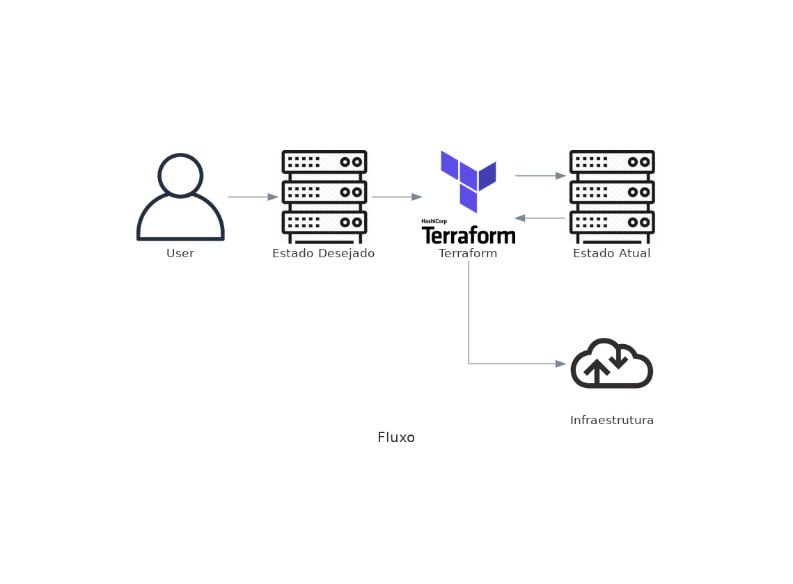

# Terraform

1. [Conceitos](#conceitos)
1. [Arquitetura](#arquitetura)
1. [Comandos práticos](#comandos)
1. [Documentação](#documentacao)
1. [Lab](#ferramentas)


<a id="conceitos"></a>
## Conceitos
- É uma ferramenta multicloud
- Sintaxe Subjectiva, declarações claras e high level
- Ferramenta de IaC - Para Infraestrutura, e não aplicação
- Opensource
- Modular

### Fluxo


<a id="arquitetura"></a>
## Arquitetura
- Provider
    - Provedor que receberá os recursos
- Resource
    - Onde você define a criação do recurso
- Variables
    - Variáveis para criação dos recursos
- Module
    - Junção de vários programas em um "pacote"

### Segmentação dos arquivos
- main.tf
    - Arquivo principal onde sao feitas as declarações
- variables.tf
    - Cuida das variaveis a serem usadas na criação
- < nome >.tfvars
    - variaveis de entrada no formato chave = valor
- terraform.tfstate
    - Arquivo que registra o estado final da infraestrutura aplicada. Extremamente importante, não dever ser commitado, mas deve ser mantido em lugar seguro

#### Exemplo de arquivo main.tf
```terraform
# Define o provider de Cloud que irá receber as interações via API. Importante: na máquina de execução, deve-se ter o binário de comunicação com o provider
provider "aws" {
    region = "us-east-1"
    profile = "aws-production"
}

# Define o recurso que deve ser implementado ou alterado no provider de Cloud
resource "aws_s3_bucket" "backup_fileserver" {
    bucket = "bkp-samba"
}

# Utilização de variáveis no recurso
resource "aws_s3_bucket" "assets_website" {
    bucket = "var.s3_website"
}
```

#### Exemplo de variables.tf
```terraform
variable "s3_website" {
    description = "Nome do bucket que contém os assets do Website"
    # tipos podem ser string, number, bool, list (tuple), map(object), null
    type = string
}
```

#### Exemplo de site-dev.tfvars
```terraform
s3_website = "development-website"
```

#### Exemplo de estrutura de pastas
- ->.terraform
    - Pasta com, módulos e plugins
- main.tf
    - arquivo de configuração principal
- site-dev.tfvars
    - Arquivo de declaração dos valores de variáveis
- terraform.tfstate
    - Arquivo de estado da infraestrutura
- variables.tf
    - Arquivo de declaração das variáveis mandatórias

<a id="comandos"></a>
## Comandos práticos

```bash
terraform init
```
- Inicializa o código
- Faz download dos módulos e plugins de providers
- Carrega o backend

```bash
terraform plan
```
- Cria um rascunho das alterações
    - É nesse passo que o Terraform confere as alterações a serem feitas

```bash
terraform apply
```
- Apply as alterações